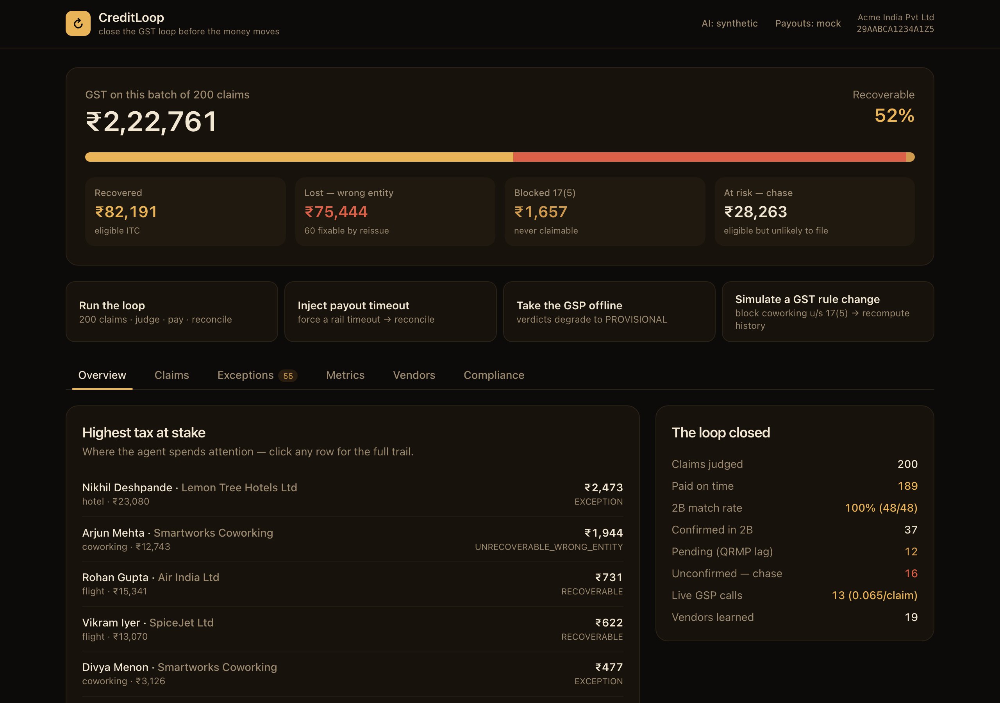
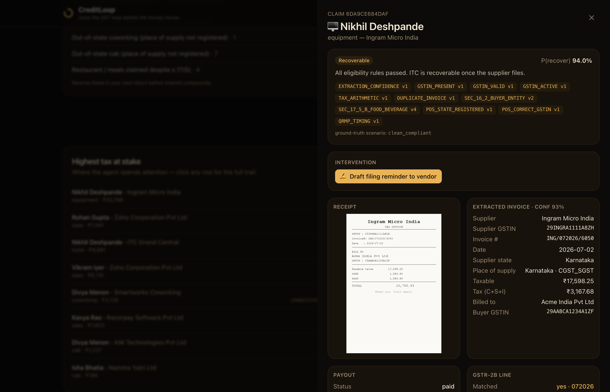
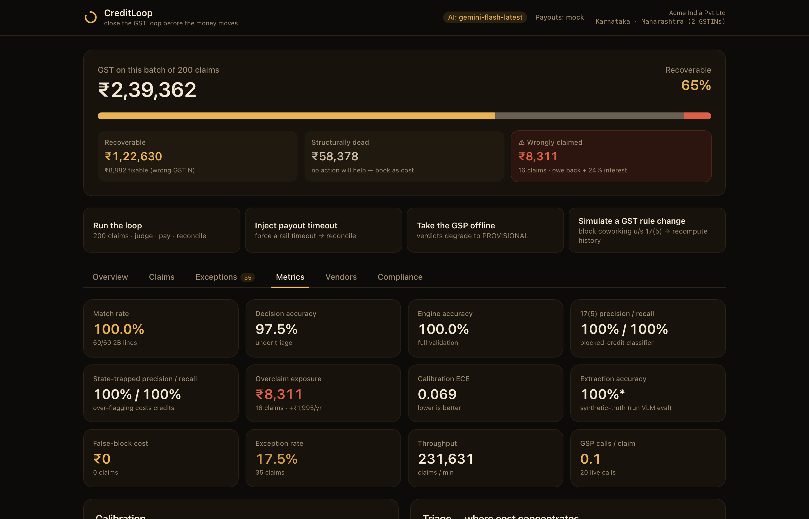
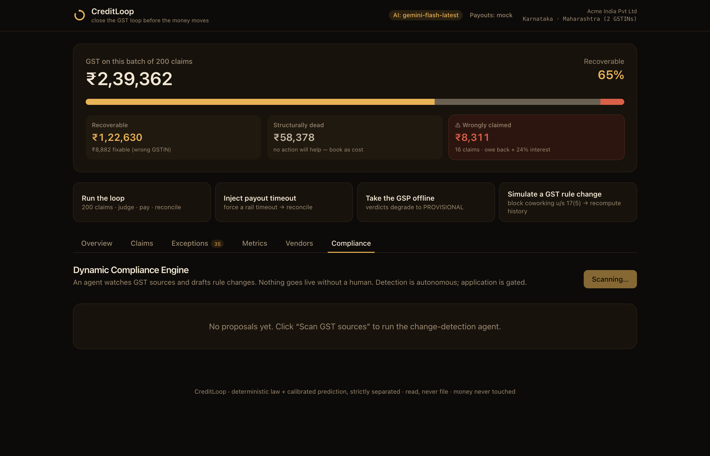

# CreditLoop

**The GST you're losing, recovered before the money moves.**

CreditLoop is an AI finance agent that catches the tax credit Indian companies quietly lose on employee expenses — and decides whether it'll come back *before* you pay the employee.

Razorpay AI Buildathon 2026 · Track 04 (AI Finance Controller).


---

## What is this, in plain words?

Say Priya travels for work and pays ₹11,800 for a hotel (₹10,000 + ₹1,800 GST). At checkout the receptionist asks "bill in whose name?" and Priya says "Priya Sharma." **That ₹1,800 just died.** Because the bill isn't in the company's name, the company can never claim that GST back. Nobody notices — it's ₹1,800, no complaint is filed. Multiply across 60 employees and it's lakhs a year, gone silently.

Why does this keep happening? A company runs **two separate systems that never talk**:

- **Paying Priya back** — she submits a receipt, a manager approves, finance pays. Fast, loud, nobody's thinking about tax.
- **The monthly GST return** — the government shows which of your purchases your suppliers *reported*. That's the credit you can claim.

The expense system knows *"Priya, hotel, ₹11,800."* The tax system needs *"GSTIN 27..., invoice HTL/2026/4471."* Different information. **There's no join key**, so no one ever lines up "what we paid" against "what we can claim back."

**CreditLoop builds that missing join, and moves the decision to before the payout — where it's still fixable.**

---

## See it working

The dashboard shows one number that exists nowhere else in an Indian finance stack: **₹ recovered vs ₹ lost**, for a batch of claims, before a rupee moves.



Click any claim for the full trail — the receipt, the extracted invoice, the verdict with the exact rule it cited, the payout, the 2B match, and a one-click **vendor reissue request** (in English or Hinglish):



Honest, measured results — including a live calibration curve and the exception list as a *feature*:



And a **Dynamic Compliance Engine**: an agent reads GST advisories and *drafts* a rule change; a human approves before anything goes live, then history recomputes:



---

## The loop, in three steps

| | |
|---|---|
| **1 · Read the receipt** | A vision model pulls GSTIN, invoice number and tax split off a crumpled photo — and *refuses to guess* when it can't read one. |
| **2 · Judge with the law** | A deterministic engine (never an LLM) decides eligibility, citing the exact rule + version. Wrong-entity, blocked, or recoverable — before payout. |
| **3 · Chase · pay · reconcile** | Pay on time, chase the vendor while it's still fixable, then match against GSTR-2B. Every rupee has an audit trail. |

The one architectural rule everything hangs on: **an LLM may never change a tax verdict or move money.** It reads, drafts, and proposes; the deterministic engine decides. (Wrong ITC carries 24% interest + penalties — "the AI decided" is not a defence.) Details in [ARCHITECTURE.md](ARCHITECTURE.md).

---

## Run it

```bash
make install     # backend (uv) + frontend (npm)
make dev         # API on :8137 + dashboard on :5173  →  open http://localhost:5173
```

Or the whole loop in your terminal, no browser:

```bash
make demo
```

Nothing external is required — GST provider and payouts run on honest mocks, receipt reading uses a synthetic-truth mode. It all works out of the box; adding an API key (below) makes the AI real.

Try the failure modes (also buttons in the dashboard):

```bash
make -C backend fail-payout   # inject a payout timeout → auto-reconcile, never double-pay
make -C backend gsp-down      # GST provider offline → verdicts degrade to PROVISIONAL, payouts still run
```

---

## Turning on the real AI (Gemini)

Receipt reading needs a *vision* model. **Use Google Gemini** — its Flash models read images on the free tier, and one key powers all three AI jobs (reading receipts, drafting vendor messages, proposing rule changes). *(Cerebras only added vision on one model in private preview, so it can't reliably read receipts yet.)*

1. Get a free key at **https://aistudio.google.com/apikey**
2. `cp backend/.env.example backend/.env` and set `CREDITLOOP_GEMINI_API_KEY=...`
3. Restart. The header flips from **"AI: synthetic"** to **"AI: gemini-2.5-flash"**, vendor drafts become AI-written, and you can measure real extraction accuracy:

```bash
curl -X POST localhost:8137/api/eval/extraction   # scores Gemini's receipt reading vs ground truth
```

Without a key, everything still runs — receipts use ground-truth, drafts use good templates.

---

## Deploy

It's a **single service**: FastAPI serves the API *and* the built dashboard, so you deploy one thing.

```bash
cd frontend && npm run build      # produces frontend/dist
cd ../backend && uv run uvicorn app.api:app --host 0.0.0.0 --port 8137
```

`http://your-host:8137/` then serves the landing page **and** the app.

### Should I use Vercel?

**Short answer: no — use Render, Railway, or Fly.** CreditLoop's backend is a stateful Python server (SQLite + it runs the pipeline on boot). Vercel is built for stateless serverless functions and a static frontend, so it's a poor fit for the backend. Two clean options:

- **✅ Recommended — one container on Render / Railway / Fly / Cloud Run.** The repo ships a **`Dockerfile`** (builds the SPA + backend into one image) and a **`render.yaml`** blueprint. On Render: *New → Blueprint → pick this repo* and it deploys everything on one URL. On first boot it creates the SQLite DB and runs the loop once, so the dashboard is populated immediately. Set `CREDITLOOP_GEMINI_API_KEY` in the dashboard to turn on real AI.
- **Split (if you insist on Vercel):** put the **frontend on Vercel** (`root = frontend`, build `npm run build`, output `dist`) and the **backend on Render/Railway**. Then set an env var `VITE_API_BASE=https://your-backend-url` on the Vercel project so the SPA calls the backend. CORS is already open. This works but is two services to manage instead of one.

### Do I need anything else to deploy?

- **Login (Clerk / Supabase)? — No.** For the buildathon, keep it open so judges try it instantly. The app is built login-free. If you later want to gate it, Clerk is a ~10-minute drop-in around the `/app` route — but you don't need it now, and no code here depends on it.
- **Razorpay keys? — No, not to run.** Payouts use a safe mock. Only if you want *real* RazorpayX test-mode payout calls do you set `CREDITLOOP_RAZORPAY_KEY_ID/SECRET` (+ a test fund account) in `.env`; it falls back to mock on any error.
- **Gemini key? — Optional but recommended** (see above) to make the AI real.
- **A database? — No.** It's file-based SQLite; the Docker image is self-contained.

---

## Measured results (200-claim batch, seed 42 — regenerate with `make demo`)

| Metric | Value |
|---|---|
| **2B match rate** | **100%** (48/48 lines) |
| Deterministic engine accuracy | **100%** (vs ground truth) |
| Decision accuracy under triage | 97% |
| Section 17(5) precision / recall | 100% / 100% |
| Calibration (ECE) | 0.13 |
| False-block rate | **0 claims / ₹0** |
| Exception rate | 27.5% (55 claims, each with a machine reason code) |
| **Live GST-provider calls / claim** | **0.06** |

**Two honest points the panel should hear:** the exception rate is a *feature* — an agent that always decides is an agent that guesses; and the 0.06 calls/claim is the engineering story — cheap claims cost nothing, live validation is spent only where money is at stake.

---

## Repo layout

```
backend/    FastAPI + uv + SQLModel/SQLite
  app/
    models.py        the append-only ledger (the join)
    engine.py        deterministic verdicts — pure, no LLM
    rule_registry.py versioned rules as DATA, cited in every verdict
    predict.py       calibrated recoverability (advisory)
    triage.py        expected-value triage (spend calls only where they matter)
    pipeline.py      the agent loop
    actions.py       idempotent payouts (impossible to double-pay)
    reconcile.py     2B matching + the vendor-reliability learning loop
    metrics.py       the eval harness
    compliance.py    Dynamic Compliance Engine (detect → propose → approve)
    drafting.py      vendor reissue / filing requests (Hinglish + English)
    llm.py           Gemini provider (vision + text), graceful fallback
    synthetic.py     the 200-claim generator (published, so you can check us)
    tools/           extract (VLM), gsp (mock), razorpay (mock + real test)
frontend/   Vite + React + TS + Tailwind + Recharts (landing + dashboard)
```

## More

- [ARCHITECTURE.md](ARCHITECTURE.md) — the three layers and why deterministic ≠ learned.
- [WHATBROKE.md](WHATBROKE.md) — honest bugs and what's still mock, not real.
